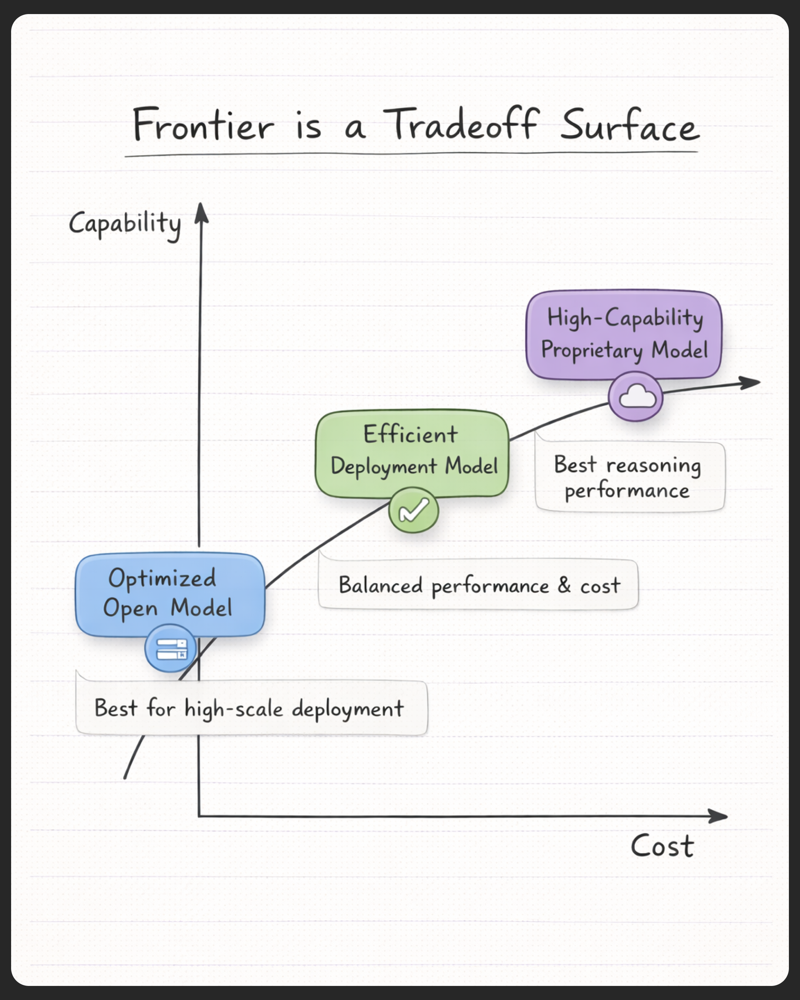

# Frontier Models

> **Track:** LLM Engineering  
> **Source:** Ed Donner (Week 1) + side research  
> **Level:** Beginner → Intermediate  
> **Last updated:** 2026-02-24  
> **Status:** Final

---

## 1) What this topic is

A **frontier model** is one of the most advanced AI models available at a given time.  
It sits at the “frontier” (the edge) of what AI can do today.

Most frontier models today are also **general-purpose**, meaning one model can handle many different tasks (writing, summarizing, coding, reasoning).

---

## 2) Why it matters

Most modern AI products are built on top of frontier models.

If you understand frontier models, you can make better engineering decisions, like:
- picking the right model for your use case
- balancing cost vs performance
- planning for latency and scaling
- deciding between open-weight and closed models

---

## 3) Key ideas

- Frontier models are the cutting edge of AI progress at a given time.
- Many frontier models are **general-purpose** (one model, many tasks).
- They often show **emergent abilities** (skills that appear when scale increases).
- “Frontier” is not only about size. There are different frontiers:
  capability, efficiency, cost, multimodal, and regulatory.
- In production, model choice is a tradeoff between:
  capability, cost, latency, and control.
- Open vs closed models is an engineering decision (control vs convenience).

---

## 4) Deep explanation

### Frontier models vs traditional ML models

Traditional ML models are usually built for one narrow task:
- spam detection
- translation
- classification

Frontier models are different. One model can do many tasks:
- write content
- summarize documents
- answer questions
- generate code
- do multi-step reasoning
- sometimes work with images/audio (multimodal)

This is why frontier models are often called **foundation models**.

---

### Key characteristics of frontier models

#### a) Large scale training
Frontier models are trained using:
- huge datasets (often trillions of tokens)
- massive compute
- large parameter counts

This scale often improves model ability, but also increases cost.

#### b) General-purpose ability
“General” means the model can switch between tasks without retraining.

Example:
- A single model can summarize a document and then write code in the next prompt.

#### c) Emergent abilities
Some abilities appear only after models become large enough, like:
- better reasoning
- following complex instructions
- tool use
- few-shot learning

These are not explicitly programmed. They appear due to scale.

---

### Different types of “frontiers”

Many people think frontier means “the biggest model.”

But frontier can mean different things:

1) **Capability frontier**  
Models with the best overall performance (especially reasoning).

2) **Efficiency frontier**  
Models that deliver strong performance with fewer parameters or less compute.

3) **Cost frontier**  
Models that give good performance at lower inference cost.

4) **Multimodal frontier**  
Models that handle text + image + audio (and sometimes video).

5) **Regulatory frontier**  
Models that are powerful enough to fall under stricter AI regulations.

---

### Production insight: frontier is a tradeoff surface

In production, choosing a model is not only “pick the best benchmark.”

It is a tradeoff between:
- **Capability** (how well it performs on complex tasks)
- **Cost** (money per request / per token)
- **Latency** (how fast responses come back)
- **Control** (can you customize or self-host?)

This is why “frontier” often looks like a curve, not a single winner.

Add this image to your topic folder:

---

### Open vs closed frontier models

#### Closed (proprietary) models
Closed models are usually accessed through an API.

Pros:
- high capability
- fast to integrate
- vendor handles infra

Cons:
- higher cost
- less control
- no access to weights

#### Open-weight models
Open-weight models provide model weights so you can run them yourself.

Pros:
- more control
- can fine-tune
- can be cheaper at scale
- better privacy options

Cons:
- requires infra + ops work
- may be slightly behind the best closed models

---

## 5) Tradeoffs (table)

| Choice | Upside | Downside | When to use |
|---|---|---|---|
| Closed/API model | Best capability, fast to ship | Higher cost, less control | You need top quality fast |
| Open-weight model | More control, can be cheaper at scale | More engineering work | You need privacy/control or long-term savings |
| Capability frontier | Strong reasoning | Higher cost/latency | Hard tasks, high value per request |
| Cost/efficiency frontier | Cheaper, faster | May be weaker at reasoning | High-scale products, tight budget |

---

## 6) Common misconceptions

- **Myth:** Frontier means “biggest model.”  
  **Reality:** Frontier can be capability, efficiency, cost, multimodal, or regulatory.

- **Myth:** Frontier models replace specialized models.  
  **Reality:** Specialized models are still useful for narrow tasks because they can be cheaper and more reliable.

---

## 7) Practical checklist (Actionable)

When selecting a model for a product:
- Define what matters: quality, speed, cost, privacy.
- Estimate inference cost early (cost per request).
- Decide if you need open-weight control or closed API convenience.
- Consider latency and user experience requirements.
- Plan evaluation and monitoring (LLMs can hallucinate).
- Start simple, then upgrade models when needed.

---

## 8) Mini summary (3 lines)

Frontier models are advanced AI models at the leading edge of progress.  
Many are general-purpose, but frontier also includes efficiency and cost.  
In production, model choice is a tradeoff between capability, cost, latency, and control.